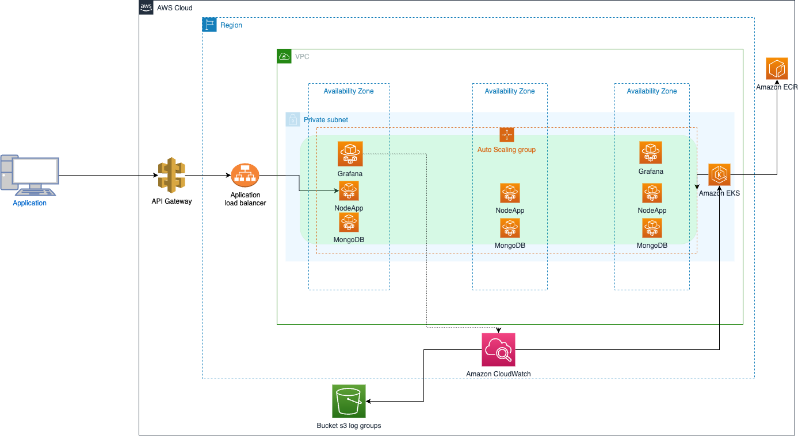
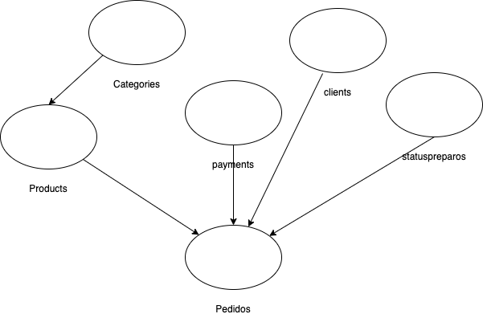

# Tech Challenge - Pós Graduação Software Architecture - FiAP

Este projeto foi desenvolvido durante a realização do curso de Pós Graduação de Software Architecture, ministrado pela FIAP. Englobando os conhecimentos obtidos em todas as disciplinas.

Desenvolvido em grupo, conta com os membros:

- Diego Luis RM352001
- Paulo Alves RM352011
- Rosangela Silva RM352014

## Índice

- [1. Objetivo](#1-objetivo)
- [2. Métodos Utilizados](#2-métodos-utilizados)
- [3. Instalação do projeto](#3-instalação-do-projeto)
- [4. Utilização](#4-utilização)
- [5. Acessando a database](#5-acessando-a-database)
- [6. Considerações finais](#6-considerações-finais)

## 1. Objetivo:

Prover um sistema de autoatendimento de uma lachonete.

## 2. Métodos Utilizados

[Miro](https://miro.com/app/board/uXjVMlKvwf0=/)

[Notion](https://www.notion.so/d473ae027b1140c6915ba85c0e87dcbc?v=66a8f70c96af43418355a530584d995d)

[NestJS](https://docs.nestjs.com/)

[Docker](https://docs.docker.com/)

## 3. Instalação do projeto

```bash
$ npm install
```

## 4. Utilização

Via docker compose é somente rodar o comando abaixo e ja estara pronto para utilziar via insomnia ou postman

```bash
$ docker-compose up
```

## 5. Acessando a database

Para acessar a base de dados do mongo basta acessar http://localhost:8081/ (user: admin, pass: pass), database fiap, na database estarao todas as collections com seus dados gerado numa carga inicial.

## 6. Subindo projeto no K8s

acessando a pasta k8s na raiz do projeto temos acesso aos arquivos de manifesto yaml e devemos aplicar eles na seguinte ordem:

Comando para aplicar o arquivo no cluster kubernets:

```bash
$ kubectl apply -f path_do_arquivo
```

ordem:

1 - metrics.yaml
2 - arquivos de configmap (db-configmap e node-configmap)
3 - mogno (db.yaml e db-service.yaml)
4 - node (deployment.yaml e service.yaml)
5 - arquivos de hpa (scaler.yaml)

com todos arquivos aplicados podemos consultar se os pods estao de pe:

```bash
$  kubectl get pods
```

estando todos de pe podemos chamar via insomnia com a colection anexa.

## 6. Subindo projeto no K8s com helm

Requisitos: Docker, Helm e aplicar as configuracoes de metricas ao seu kubernets previamente (arquivo de metricas disponiveis em k8s/arquivos yaml individuais sem helm )

acessando a pasta k8s na raiz do projeto temos acesso ao manifestfo helm postech-fiap

Comando para empacotar o manifesto para deploy no k8s.

```bash
$ helm package postech-fiap
```

Apos o comando sera gerado um pacote na pasta k8s que é o instalavel da nossa aplicacao completa para k8s

Para instalar o pacote basta executar o seguinte comando estando na pasta k8s:

```bash
$  helm install postech-fiap-0.1.0.tgz --generate-name
```

Apos rodar o comando é so acompanhar a subida das taks pelo docker desktop ou rodando o comando:

```bash
$  kubectl get pods
```

Pode levar um breve momento ate as taks subirem e o app de conectar ao banco, acompanhar os logs via docker desktop

Apos tudo estar de pe, podemos realizar os testes via postman apontando para a nodePort exposta: http://localhost:31100/

## 6. Desenho de arquitetura cloud



## 7.Infra terraform

Para funcionar corretamente o deploy automatizado precisamos preencher algumas variaveis que sao geradas no momento da criacao do cluster e por motivos de custos nao colocamos no secret manage

- host do cluster
- nome do cluster
- certificado de autenticacao do cluster

Os pontos de insercao dos dados estao demarcados nos arquivos to-eks.yml, e no terraform.tf

## 9. Porque MongoDB?

O MongoDB por ser um banco de dados NoSQL de código aberto, foi projetado para oferecer flexibilidade, escalabilidade e desempenho em ambientes com nuvem e aplicativos da web.

O MongoDB adota um de esquema flexível, permitindo que seu desenvolvimento seja armazenado de maneira mais dinâmica e adaptável.

O MongoDB tem caracteristicas atraente em sua adoção:

**Flexibilidade do esquema**: Oferece flexibilidade em seus esquema, permitindo armazenamento sem uma estrutura predefinida. Isso facilita a adaptação/mudanças nos requisitos e permite uma modelagem de dados mais dinâmica.

**Escala horizontal**: É altamente escalável e lida com grandes volumes de dados distribuídos em vários servidores. Suporta replicação automática e fragmentação de dados, permitindo que OS dimensionem horizontalmente à medida que crescem.

**Desempenho**: Oferece um desempenho rápido para operações de leitura e gravação, principalmente com leituras intensiva. Sua arquitetura de indexação eficiente e consultas poderosas ajudam a otimizar o acesso aos dados.

**Modelo de dados rico**: Suporta uma ampla variedade de tipos de dados e recursos avançados, como arrays, documentos incorporados e indexação geoespacial. Isso permite que possamos criar aplicativos ricos e complexos sem comprometer a eficiência ou a escalabilidade.

**Comunidade e suporte**: Existe uma grande comunidade de usuários e desenvolvedores ativos, oferecendo recursos, tutoriais e suporte online. Além disso, a empresa por trás do MongoDB, a MongoDB Inc., oferece serviços de suporte profissional para organizações que precisam de assistência adicional.

## 8.ER


